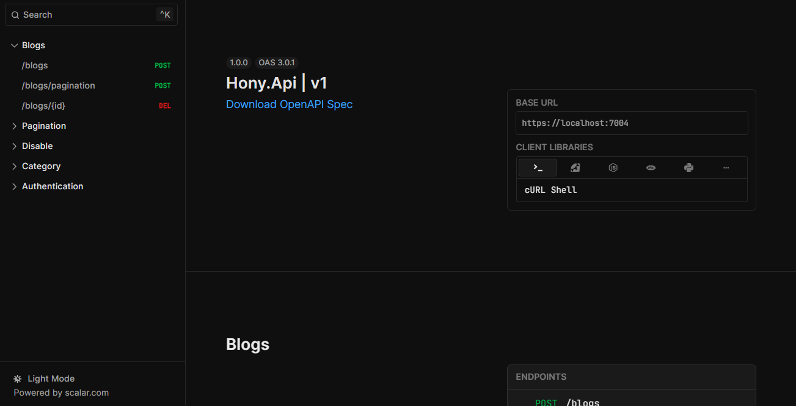

# Hony API
___

Hony es una API de blogs diseñada para proporcionar funcionalidades básicas para crear, leer, actualizar y eliminar publicaciones de blog, así como gestionar usuarios y comentarios. Esta API sigue el estilo RESTful y utiliza JSON para la transferencia de datos.

### Características:

Publicaciones de blog: Crear, leer, actualizar y eliminar publicaciones.

Usuarios: Registro de usuarios, autenticación y gestión de perfiles.
Comentarios: Añadir y gestionar comentarios en las publicaciones.

## Vista previa

### Construyendo la aplicación

Cuando esté listo, inicie su aplicación ejecutando:

`La ventana acoplable compone --build`.

Su aplicación estará disponible en http://localhost:8080.

### Implementación de su aplicación en la nube

Primero, cree su imagen, por ejemplo: `docker compose up -t myapp.`.

Si su nube utiliza una arquitectura de CPU diferente a la de su desarrollo máquina (por ejemplo, tiene una Mac M1 y su proveedor de nube es amd64), querrás crear la imagen para esa plataforma, por ejemplo: 

`docker build --platform=linux/amd64 -t miaplicación.`.